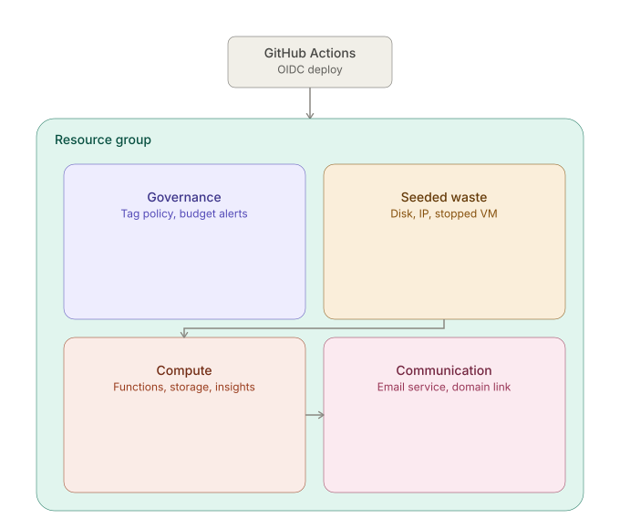
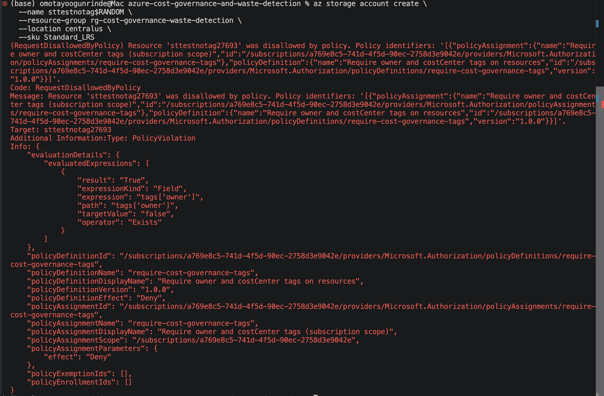
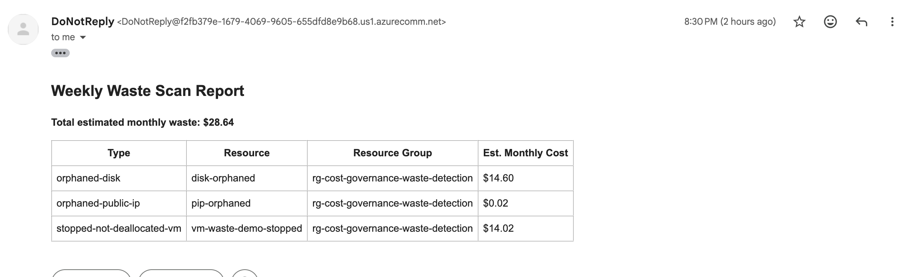
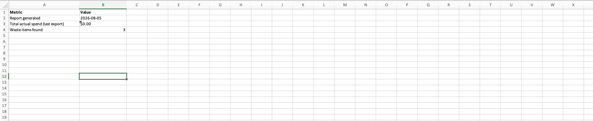
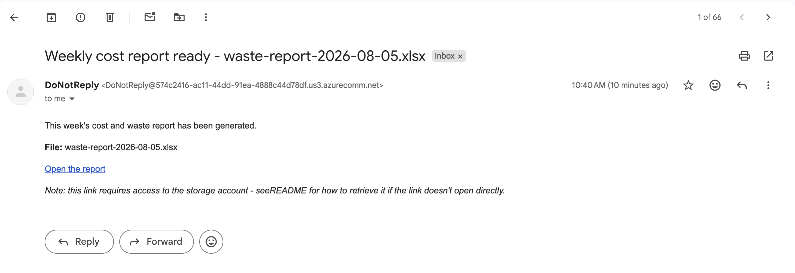
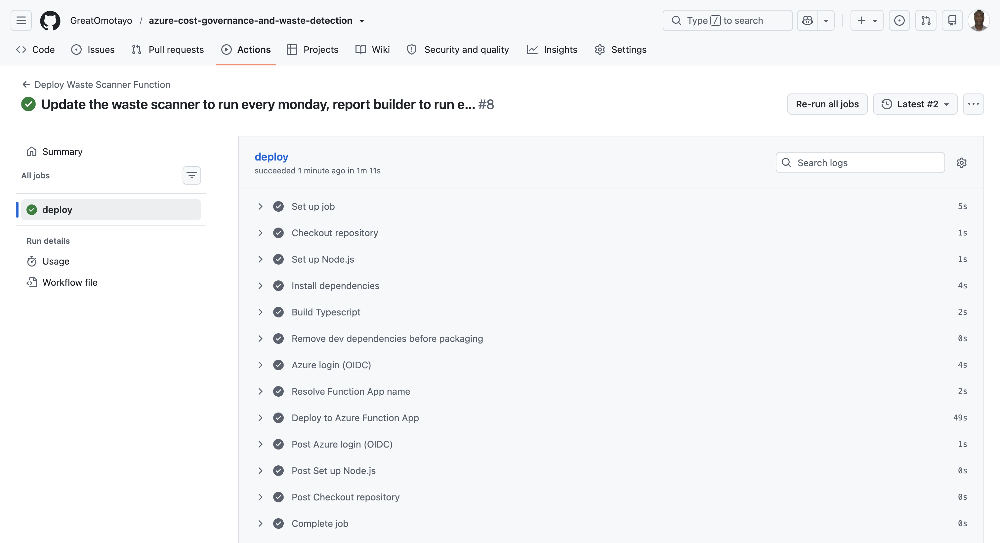
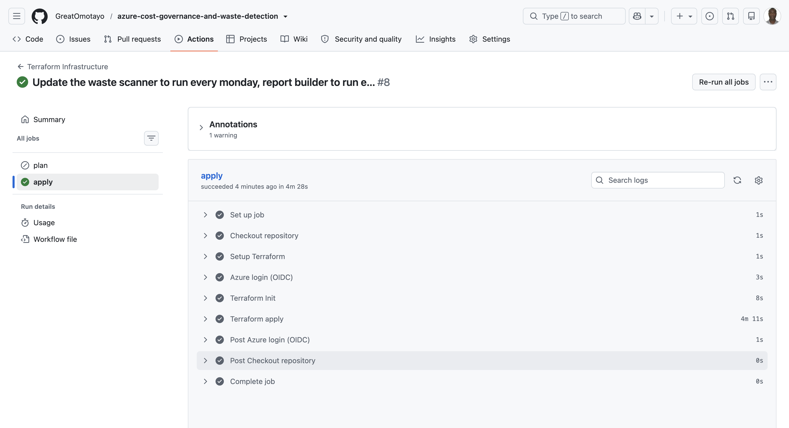
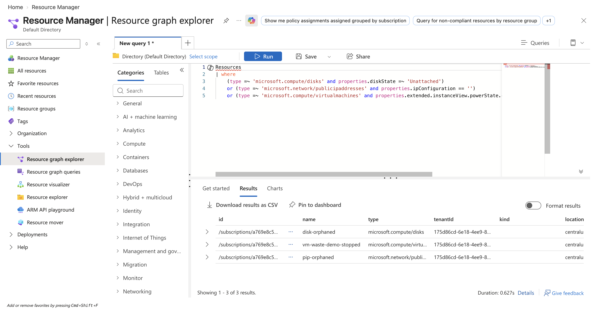

# Automated Cost Governance & Waste Detection

An Azure portfolio project that enforces cost accountability before spend happens, catches waste that slips through anyway, and turns both into a weekly report a non-technical stakeholder can actually read.

Built with Terraform, Azure Policy, Azure Functions (Node.js 22), Azure Communication Services, and OIDC-based GitHub Actions CI/CD — with zero long-lived secrets anywhere in the pipeline.

🎥 **[Watch the full walkthrough](https://www.loom.com/share/e5adb9ab04314811aa0b637e2aea0e9a)** — build, architecture, and a real bug hit and fixed along the way.

---

## Why this project

Cloud spend is notoriously easy to lose control of: resources get over-provisioned "just in case," test infrastructure gets spun up and never torn down, and by the time anyone notices, the waste has been running — and billing — for months. Industry estimates consistently put wasted cloud spend at 30%+ of total bill. Most teams treat cost control as a quarterly cleanup exercise rather than an ongoing discipline.

This project demonstrates both halves of a real cost-governance practice:

- **Prevent** — a subscription-wide tagging policy and budget alerts stop obviously careless spend before it happens.
- **Detect** — an automated scanner catches the waste that slips through anyway (orphaned disks, unused IPs, VMs left running in a billed-but-idle state), and reports it with a real dollar figure calculated from live Azure pricing — not a guess.

## Architecture



**Governance layer** (subscription-wide):
- Custom Azure Policy, hard-deny, requiring `owner` and `costCenter` tags on every resource
- Consumption Budget with two-stage email alerts (50% and 90% of a $20/month threshold)

**Detection layer:**
- A weekly **waste-scanner** Azure Function queries Azure Resource Graph directly for three real waste patterns: unattached managed disks, unassociated public IPs, and VMs left in a stopped-but-not-deallocated state (a common and costly Azure-specific trap). Findings are priced using Azure's live Retail Prices API and emailed as a formatted summary. Runs **Mondays at 8am**.
- A separate **report-builder** Azure Function runs **Tuesdays at 9am** — one day later, deliberately, so Azure's own Cost Management export (which also runs weekly) has time to actually land in storage before the report-builder tries to read it. It combines that export with a fresh waste check into a two-sheet Excel workbook, and emails a short "your report is ready" notification.

Both functions run independently by design — see [DECISIONS.md](DECISIONS.md) (D-series) for why.

**Security posture throughout:**
- Every Azure-to-Azure authentication uses **Managed Identity** — no API keys, no connection strings, no stored secrets
- Every GitHub Actions → Azure authentication uses **OIDC federated credentials** — no service principal secrets in GitHub
- RBAC is scoped narrowly per identity, though "narrowly" took a few rounds to get right — the Function's runtime identity holds subscription-wide `Reader` (for the waste scan), `Storage Blob Data Contributor` (data-plane, distinct from managing the storage account itself), and `Communication and Email Service Owner` (data-plane, distinct from `Contributor`, which does *not* cover sending email despite looking like it should). The CI/CD identity has `Contributor` plus `Resource Policy Contributor` and `User Access Administrator` at subscription scope, gated behind a manual approval step before any `apply`. See TROUBLESHOOTING.md for why each of these turned out to need its own explicit grant.

## What's in this repo

| Path | Purpose |
|---|---|
| `providers.tf` | Terraform + Azure provider setup, remote state backend |
| `variables.tf` | All configurable inputs (region, tags, budget threshold, etc.) |
| `main.tf` | Resource group + subscription-scoped tagging Policy |
| `budgets.tf` | Consumption Budget + email Action Group |
| `waste-seed.tf` | Deliberately planted waste resources (disk, IP, stopped VM) for the scanner to detect |
| `function-infra.tf` | Function App hosting, Managed Identity, RBAC, Communication Services |
| `cost-export.tf` | Native Azure Cost Management scheduled export |
| `outputs.tf` | Key resource names/IDs surfaced after deployment |
| `function/waste-scanner/` | Node.js/TypeScript function — Resource Graph scan → priced findings → email |
| `function/report-builder/` | Node.js/TypeScript function — CSV + waste check → Excel report → email |
| `.github/workflows/deploy-function.yml` | CI/CD for Function code, triggered on changes to `function/` |
| `.github/workflows/terraform.yml` | CI/CD for infrastructure — plan on PR, apply on merge (manual approval gated) |
| `DECISIONS.md` | Running log of architectural decisions, alternatives considered, and rationale |
| `TROUBLESHOOTING.md` | Chronological log of every real bug hit during the build — root cause, fix, and the lesson from each |
| `screenshots/` | Evidence images referenced in the Screenshots section below |

## One-time setup (not managed by Terraform)

A few things have to exist before Terraform or GitHub Actions can run, since each is a genuine bootstrapping gap — infrastructure needed to manage infrastructure.

**1. Remote state storage** (run once, manually, via Azure CLI):
```bash
az group create --name rg-tfstate --location centralus
az storage account create --name sttfstateomotayo --resource-group rg-tfstate \
  --sku Standard_LRS --encryption-services blob --min-tls-version TLS1_2
az storage container create --name tfstate --account-name sttfstateomotayo --auth-mode login
```

**2. GitHub OIDC federated credentials** — see the full setup (App Registration, federated credentials scoped to this repo, RBAC) documented in [DECISIONS.md](DECISIONS.md).

**3. Required GitHub repository secrets:**

| Secret | Value |
|---|---|
| `AZURE_CLIENT_ID` | App Registration client ID |
| `AZURE_TENANT_ID` | Azure AD tenant ID |
| `AZURE_SUBSCRIPTION_ID` | Target subscription ID |
| `ALERT_EMAIL` | Email address for budget alerts and reports |

**4. `terraform.tfvars`** (gitignored, never committed) — see `terraform.tfvars.example` for the required shape.

**5. Email Communication Service domain linking** — provisioning the Email
Communication Service, its Azure-managed domain, and the Communication
Service resource are three separate steps, and none of them automatically
link to each other. Confirm the domain is actually attached:
```bash
az communication show --resource-group <rg> --name <communication-service-name> --query "linkedDomains"
```
If empty, link it — see TROUBLESHOOTING.md (#10) for the full fix. This is
easy to miss because email sends fail with what looks like an RBAC error
even when permissions are entirely correct.

## Key engineering decisions

Every non-trivial choice in this build — and several more than are listed below — is logged in [DECISIONS.md](DECISIONS.md) with the alternatives considered and the reasoning behind the final call, written as the decisions were made rather than reconstructed afterward. Highlights:

- **Structural waste only, not performance-based waste** — avoids the multi-day telemetry lag Azure Advisor requires, keeping the whole project demoable on demand
- **A stopped-but-not-deallocated VM as one of the seeded waste patterns** — the single most common and least understood Azure billing trap, handled via a documented, scoped CLI exception where Terraform's declarative model can't express the state directly
- **Managed Identity everywhere** — zero stored secrets across both the runtime Function and the CI/CD pipelines
- **Two independent functions, not a shared data pipeline** — trades a small amount of duplicated query logic for resilience against partial failure

## Known limitations / what I'd change for production

- `prevent_deletion_if_contains_resources = false` — set for lab convenience; would be `true` in a real environment
- Excel report links in email require Azure Portal/CLI access rather than a direct clickable SAS-token link (documented trade-off, not an oversight)
- Node 22 is the final Node.js version supported on the Linux Consumption plan; a production build today would target the Flex Consumption plan instead
- AzureRM provider is pinned to `~> 4.81` rather than the current 5.x line — an open upstream bug causes ID-parsing failures on `azurerm_storage_container` when migrating existing state to 5.x (see TROUBLESHOOTING.md, #7). Revisit once that's resolved upstream.

## Verifying the deployment

Both functions run on weekly timers, which makes "did this actually work" slow to confirm naturally — waiting a full week just to see if a schedule fires correctly isn't a reasonable test loop.

**Practice used during this build:** temporarily tighten the timer schedule immediately after deploying (e.g. `0 */10 * * * *` — every 10 minutes) to confirm the function fires and the expected email/report actually arrives, then revert to the real weekly cadence (`0 0 8 * * 1` for the scanner, `0 0 9 * * 2` for the report-builder) before considering the deployment complete. This is a deliberate verification step, not a leftover — don't ship with a tightened schedule.

**If a deployed function ever shows zero entries** in the Portal or
`az functionapp function list` despite a green CI run, don't trust Azure's
own host status/logs to explain why — a genuine indexing failure can report
`state: Running` with no errors while having zero functions loaded. Run
`func start` locally (`cd function && npm run build && func start`) instead —
it surfaces language-worker load errors immediately that never make it into
Azure's own logging. This is exactly how the root cause in TROUBLESHOOTING.md
(#8) was actually found, after every Azure-side check came back clean.

## Screenshots

<!-- Capture these once deployed and drop the image files into /screenshots — update the alt text below if you rename anything. -->

**Tagging policy blocking an untagged resource**


**Weekly waste-scanner report email**


**Excel cost report — Summary sheet**



**GitHub Actions — both pipelines passing**



**Resource Graph Explorer — same waste items found**


## Tech stack

Terraform · Azure Policy · Azure Consumption Budgets · Azure Resource Graph · Azure Functions (Node.js 22 / TypeScript) · Azure Communication Services · Azure Cost Management · GitHub Actions · OIDC / Workload Identity Federation
